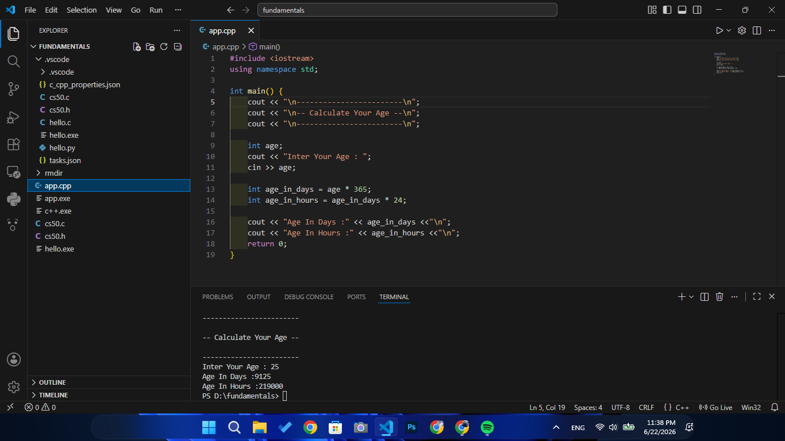

# Calculate Your Age

A simple C++ application that calculates the user's age based on the birth year entered by the user.

## Features
- Calculate age from birth year
- Simple user input and output
- Beginner-friendly project

## Concepts Used
- Variables
- Data Types
- User Input & Output
- Arithmetic Operations

## Technologies
- C++

- ## Preview

## Author
Mohamed Waleed
